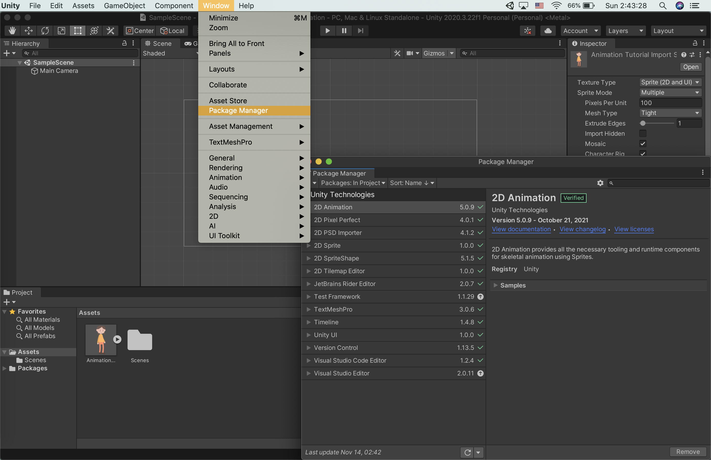
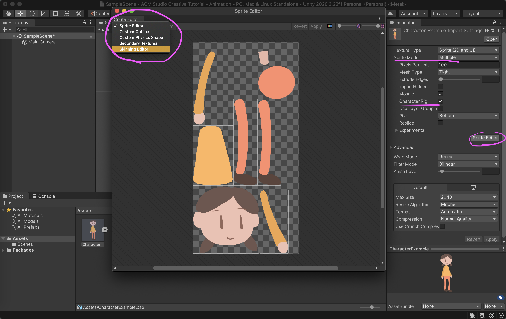
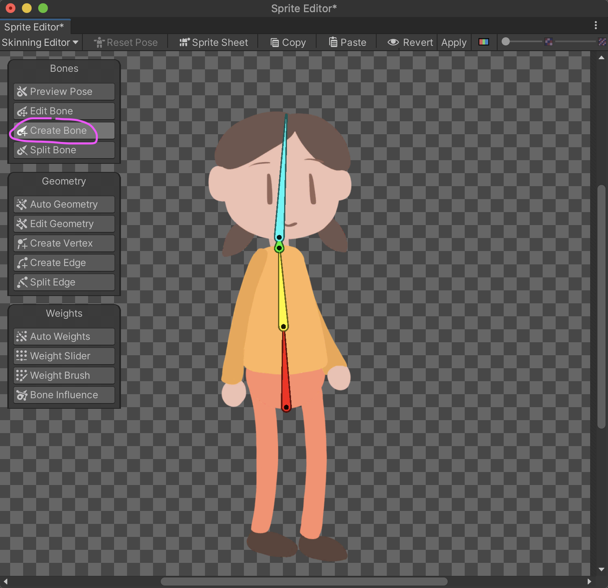
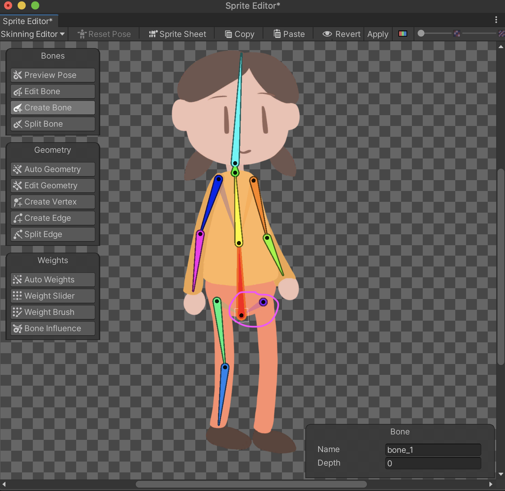
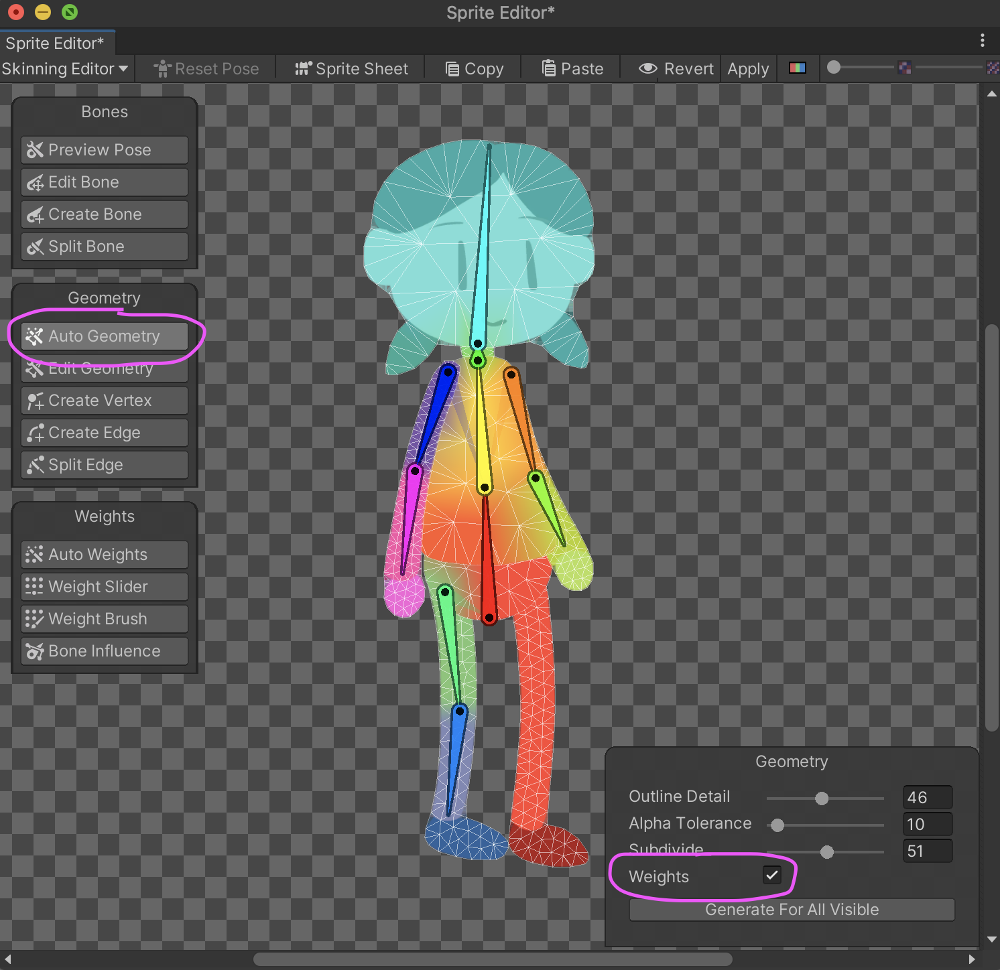
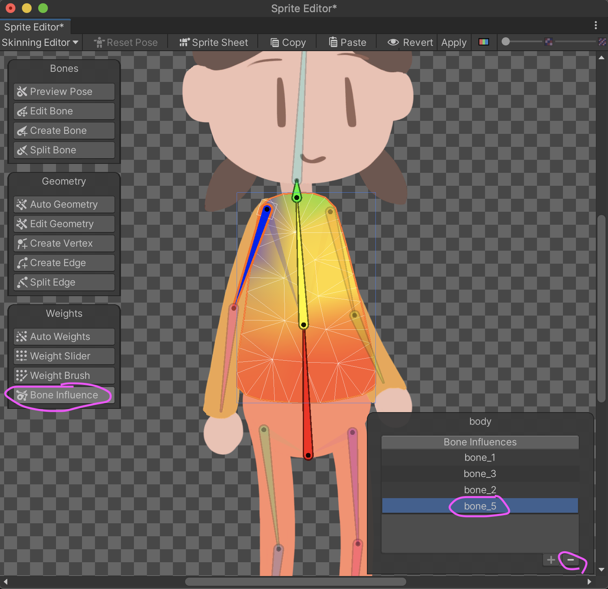
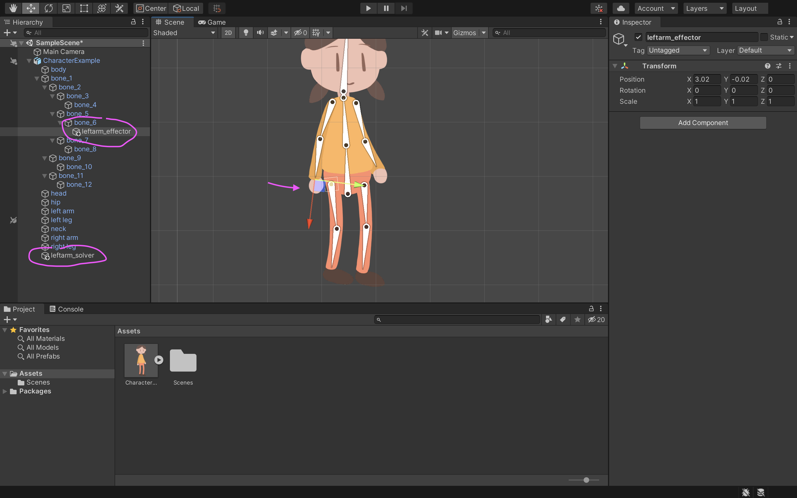
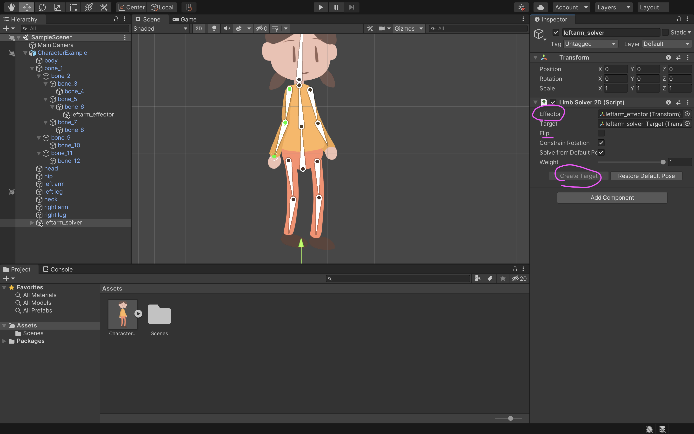

# Studio Creative Tutorials - 2D & 3D Animation
 
**Date**: November 15, 2021 
**Location**: Online (On Zoom) 
**Instructor(s)**: Caroline Wang, Athena Dai
 
## Resources
[Video](https://youtu.be/iRmBxDrh5gk) 
[Zoom Link](https://ucla.zoom.us/j/99684783298?pwd=Ykh2NlJCTDdoRGYxZzg2Z2xVWU1RZz09) 
 
## Topics Covered
* Good Animation Practices and Basics
* Skinning Editor
* Bones, Geometry, and Weights
* Inverse Kinematics (IK) and IK Solvers
* Animation State Machine
* Animation Blending
* Animation Retargeting
* Basics of Rigging
* Animation Constraints
 
## What you'll need
* [Unity Hub](https://unity.com/download)
* [Unity 2020.3.19f2 or Unity 2020.3.22f1](https://unity3d.com/unity/qa/lts-releases)
* [This PSB for 2D Portion](https://github.com/uclaacm/studio-creative-tutorials-f21/blob/main/2D%20%26%203D%20Animation/CharacterExample.psb)
* [This Package for 3D Portion](https://github.com/uclaacm/studio-creative-tutorials-f21/blob/main/2D%20%26%203D%20Animation/3DAnimTPKG.unitypackage)
---
## 2D:

### 2D Rigging
As opposed to frame by frame animation, 2D rigging Animation typically offers smoother results and a faster, more flexible workflow. To get started in Unity, ensure that you have the correct version of Unity downloaded (refer to the link above in "What you'll need"), as well as the proper packages which will allow you to create a character to rig. Because the 2D IK package is now included in the 2D Animation package, the only two packages you will need for this portion of the tutorial is **2D Animation** and **2D PSDImporter**. Both of these can be found through "Window" > "Package Manager". Ensure that both are in "Packages: In Project". 
 

In the Assets folder, you may drag in the file labeled "CharacterExample.psb". When creating the character asset for the purpose of 2D rigging, you should keep in mind that any separate part of the body you want to move around should be on a separate layer (e.g. head, limbs, chest, etc.). PSB files conveniently separate the layers of a photoshop file, which simplifies the workflow visually by a bit. It is also possible to use PNG files, but you must make sure that each part of the body you would like to rig is separated from each other. 

### Skinning Editor

Once you click on the character PSB, set the Sprite Mode to "Multiple" and check the box next to "Character Rig". You can then click "Sprite Editor" which will bring up a new window with all the layers of the file separated. Make sure that each part is accurately configured and if not, you can manually fix it by dragging the edges of the box. Once you're satisfied, you can move to the top left tab of the window and change the setting from "Sprite Editor" to "Skinning Editor". The Skinning Editor will allow you to prepare your character for rigging. 
  

### Bones, Geometry, and Weights

As you can see, since you're using a PSB file, the Skinning Editor will automatically place all the body parts in their correct locations. To start off, create the bone going down the center of the character's body (you can select the "Create Bone" button on the left side of the Skinning Editor). Left click to create a bone and start from the bottom of the hip and go all the way to the tip of the head. For this example, I've created two bones going up the main body (one for the hips, one for the chest), one bone going up the neck, and one last bone for the head. You can right click to end the chain of bones.  
  

In order to get started with creating the bones for the limbs, you should keep in mind that while the bones of the limbs should be connected to the chest and body, there should not be a direct bone connecting them. Instead, they should be parented. In order to do this, you can left click on the chest bone (the yellow one in this case) and drag it to the shoulder of an arm. Create two bones: one for the upper arm, one for the lower arm, separating at the elbow area. Do the same for the other arm, as well as the two legs (the legs will be parented with the hip bone (red) instead since it is closer). You can click "reparent bone" on the left side of the Skinning Editor to see the hierarchy of the bones and how they are parented.  
  

Now, we can start pairing the bones we've made to the actual sprite. To get started, click "Auto Geometry" on the left. A small window should appear on the bottom right of the Skinning Editor. Make sure "Weights" is checked off and generate the sprites. This should create a colorful mesh (the colors corresponding to the color of the nearby bones) around your character. If you would like to clean up any edges of the mesh, you can click "Edit Geometry" to manually edit the edges through creating vertices or edges. You have now loosely (and messily) paired the bones to the sprite. However, if you preview the pose while moving around the bones, a lot of strange interactions still occur. 
  

In order to fix these issues, we should edit the "Bone Influence" (found on the left). Here, you can select different parts of the sprite (e.g. the head or the upper body), and see which specific bones are influencing it. For instance, select the body sprite. You will immediately notice that although the bones running through it are red and yellow, there are many other splotches of color influencing the way the body moves. An unwanted interaction is when you move the right arm, the right side of the body stretches with it. To fix this, you can delete the bones from its influence by selecting "bone_8" (or any other unwanted bone) and clicking the minus symbol. You should make sure all the limbs' bones are not influencing the body. 
  

To get more detailed with bone influence, you can use the Weight slider to determine how much you want a bone to influence a part of the body. Click the "Weight Slider" and select a part of the body to edit. You can then click on a bone which you think might be having too much influence and slide the "Amount" bar left and right to suit how much you think the bone should influence the part of the body.  

Another method you can use to achieve this idea is by using "Weight Brushes" (which will give you more manual control). The idea is more or less the same: select the body part you would like to edit to "paint" the weight of each bone's influence on the area. You can change the hardness of the brush, the size, as well as which bone (color) you're painting.  
  

Play around with these until you reach a satisfying result (you can click preview pose and wiggle around the bones to see the effects of your edits). Once you're satisfied with editing geometries and weights, click "Apply" on the top right of the Skinning Editor. You can then drag in your character to the Scene (go ahead and resize/reposition the sprite to your liking).  

### Inverse Kinematics (IK)

Finally, we will create Inverse Kinematics solvers. These solvers are essentially responsible for making the necessary calculations that make animating a bit easier and smoother. We will be creating 4 limb solvers as an example. To start off, click "Add Component" under the Inspector and search for "IK Manager 2D". Click the plus sign and add a Limb solver (this should appear on the left under CharacterExample) for your left arm. Next, create an empty object under the character's left arm's lowest bone. This object will be the effector. You can use the transform tool to drag the point to the end of the left limb. 
  

Then, click back on the Left Arm Solver and drag the Left Arm Effector to the Effector Bar under Inspector (Limb Solver 2D). You should then see that you are able to create a target. Create the target and the points on your bones should turn green. If you drag at the edge of the limb, the two bones will move accordingly to that point. If the limbs are bending in strange angles, you can check the "Flip" checkbox and it will flip the angles into what is hopefully accurate. 
  

---
## 3D:

### Mixamo
Animation is a separate category than modeling, and can require different skills. For the purposes of this topic, we will not be covering model creation or skeleton creation (like in blender, maya, etc.), as that is usually done outside of Unity. If you want to know how modeling feeds animation, please visit this file here to learn about how they interact.

Because of this case, we will instead be using a free animation library from Adobe called [mixamo](https://www.mixamo.com/#/). This library has an assortment of pre-set models and a wide range of animations, all for free. For efficiency, all of the needed animations and models have been included in the Unity package, but we will run through Mixamo's use cases all the same.

First, Mixamo's main interface. You can choose a core character in the "Character" tab, and all future animations you choose (regardless of the animation's preview image) will apply to that character model. For example, in the screenshot below, "TheBoss" model was first chosen, and then the "Capoeira" animation was chosen. Despite the preview for the Capoeira animation being the YBot, it is retargeted for the boss. You can verify this by looking at the title over the animation. You can also search for specific animations and models. 

Zooming in, we can examine the properties of the animation scene. The buttons on the lower left allow you to navigate the scene and look at the animation from different perspectives (including a skeleton perspective); hovering over them will let you know their properties. 

To the right, there are a lot of different parameters that dictate how the animation can be edited directly from Mixamo. Looking at the previous screenshot and this one, one can see that these properties are highly animation specific; simply modifying the settings will usually let you see what they effect quite easily, and if it doesn't, toggle skeleton mode. You can also upload your own character model if you want to apply the animation to your own models. 

The "Mirror" and "In Place" toggles are important for your animations. One will completely flip the animation (EX: If the animation steps in a left-right sequence, it will now step right-left), and "In Place" determines if the animation itself has inherent movement, or simply moves in place. One must be extremely careful if they want animations to have inherent movement or just move in place, as that often dictates the "type" of animation that Unity will perform on the model. 

Once you find an animation and you hypothetically want to download it, you will be met with a series of options.
**Format:** This deals with how the information about the skeleton and model will be kept and processed. If you are using Unity, there is a specific FBX for Unity format.
**Skin:** This is asking if you would like the model to be exported along with the animation. If you already have the model, materials, and textures, this is unecessary-- it will just export the animation instead.
**Frames Per Second:** This has the same meaning as 2D or frame by frame animation-- simply asking you how many times the animation will be rendered per second. A lower framerate means the animation is smaller in file size and less intensive to compute, but can lead to choppier animation.
**Keyframe Reduction:** This is a form of animation culling that is meant to optimize animations. Essentially, if from one frame to another the animation only changes a minute amount, keyframe reduction will remove the second frame entirely. This is also a way to save space and computation, but can also lead to choppier/incorrect animation.

### Setting up an Animator
Upon opening the TUTORIAL scene, you should see the xBot@idle model in the middle of a plane. Despite the xBot@idle model having an idle animation attached to the core import and assuming the first frame/pose of the idle animation, on play that the animation will not play. 

To get the animation to work, you need to create an animator. To do this, navigate to Project > Animators, then right click and go to Create > Animation Controller. Name it whatever you wish. Then drag and drop that animator onto the xBot@idle object in the scene (you can do this by dragging it to the heirarchy, or by dragging it to the xBot@idle object specifically above the "Add Component" button). 

Now open up the animator tab. Navigate to Window > Animation > Animator. It should open up a blank looking grid, but once you select the xBot in the hierarchy, it should be auto-populated by "Entry", "Exit", and "Any State" tabs. 

  
What is an Animator?

  An Animator is essentially a wrapper that helps maintain, transition, and edit a group of animations. Using it, you can map out how certain animations should transition to others and when, what animations should override others, and more.

The animation still won't play until we add the idle animation to the animator. However, if we add the idle animation as it is (attached to the model in the project), the idle animation will play once, and then stop. Click edit on the animation to access its properties.

  
Why can I not edit the animation directly?

  This is because the animation is bound to the model, and Unity will not let you edit bound objects easily because it essentially will edit the components of the overall object.

Scroll down until you reach the Idle animation. There, you should see a "Loop Time" variable. Toggle the variable on. This will loop the Idle animation indefinitely. Then, drag and drop that animation into the animator. It should be immediately bound as the default state and turn orange. When you press play, the idle animation should now play successfully, and indefinitely. 

### Animation Transitions and a Basic Walk/Run
We now also want to make the xBot walk and run. To do this, we must first navigate to Assets > Movement, and drag and drop "Walking" and "Running" into the Animator.

However, if you press play right now, only the idle will play. This is because we need to create animation transitions that will specify what requirements need to be fulfilled before animations are played. If pressing down the "W" key means we should walk, we need to specify that. 

To do this, right click on the Idle animation and select make transition. You should see an arrow connected to your cursor. Drag that arrow over to the "Walk" animation and click.That creates a transition from your "Idle" to "Walk". 

Repeat this from "Walk" to "Idle", and make the same set of transitions from "Walk" to "Run". Your transitions should look like below. If you make a mistake, simply click on the transition (it should be highlighted blue) and then press the "Delete" key.

Now that we have our transitions hooked, we need to specify what parameter, exactly, will make the animator change from one animation to another. To do this, switch to the "Parameters" tab in the Animator (if you weren't there already) and click on the "+" button, then create a Bool. Name the variable "isWalking". Make another, and name it "isRunning". 

  
What is a Bool?

  Bool is short for Boolean, and it evaluates things to either "True" or "False". So if we have a bool variable called "isEating", then it will essentially evaluate always to some object is eating, or isn't eating. Another way to think about it is that it is a variable that will evaluate to one of two values given some prerequisites.

Now we will modify the transitions to recognize these parameters. Click on the transition from idle > Walk (it should turn blue) and in the inspector, find the "Conditions" tab. Click on the "+" button to add a condition; this will essentially give the Animator a requirement that must be met to transition from Idle > Walk. In this case, we want the Animator to change the animation when isWalking is True. Set the variable and variable value until they match the screenshot below. 

Create conditions for the other transitions. They should be as follows:
* Walk > Idle should have "isWalking" + false.
* Walk > Run should have "isRunning" + true.
* Run > Walk should have "isRunning" + false. 

An example is below. 

Now, in your project folders, navigate to Assets > Scripts and drag and drop the "MovementScript" script onto the xBot in the scene (you do not need to understand the contents). Once this is done, you can press play and press the "W" key to walk, and the "Left Shift" key to run. Your animations should now begin working almost perfectly-- but not quite. 

You should notice an incredibly long lag time between holding down the "W" key and when the walk animation actually begins. This is because we have enabled animation "Exit Time". Navigate to your Animator, select on the transition from Idle > Walking, and you'll see in the inspector that "Has Exit Time" is checked. What this does is essentially force a certain animation to play for however many percent specified in the "Settings" tab (default to 98.4%) before the next animation can play. This is useful in some cases, but not in cases where we need player feedback to feel reactive and snappy. Toggle that off for all transitions. 
 

Now, your Walk/Run animations should transition smoothly and quickly depending on the keys you press.

### Animation Blending
A very common use case is needing to blend animations together. What if we want a character to take a punch, and then fall to the ground? It's much easier to find a punched animation, and a falling animation, rather than one with both together. It also helps us resolve unpredictable interpolation, simplify our animation states, and much more.

To introduce the animation system, we will be creating an animation where the xBot model is punched, and then collapses onto the ground. Right click on an empty space in the Animator, then click Create State > From New Blend Tree. 

Rename the blend tree to "PunchToStun", and then create transitions from Idle > PunchToStun and back. 

Double click into the "PunchToStun" blend tree. You should see a "Blend" parameter, with a slider. There should also be a corresponding float (tldr: a kind of able-to-be-decimal number) under the parameters. Rename that to "stunTime". 

  
Why a Float?

  The core of blend trees is to transition from one animation to another depending on a sliding value. Let's say we want to blend between animation A and B. Depending on how close a value is to 0, the animation is closer/more similar to animation A, and depending on how close a value is to 1, the animation is closer/more similar to animation B. We can't have this kind of fine-tuned control with a Bool, which only has two states; therefore, we use a float, which is a number that can have decimal values and thus can be modified and tracked in the range of 0-1.

Return to the Base Layer, and modify the transition from Idle > PunchToStun to be stunTime + Greater + 0, and modify the transition from PunchToStun > Idle to be stunTime + Less + 0.05. What this does is essentially act out the punching and falling animation once the blending begins to happen, which is also when the stunTime is greater than 0-- and then returning to Idle once the model has recovered, which is when the blend is approaching 0. Below is an example.

While blend trees can get complex --adding blend trees within blend trees to blend multiple series of animations, etc-- what we will be working with today are motion fields. These are simply different animations that the blend tree will transition between. Create two by clicking on the "+" symbol underneath "Motion" and adding two Motion Fields. 

Then, drag and drop the "Big Hit To Head" animation and the "Stunned" animation into the 1st and 2nd motion field slots respectively. You should see them show up in the Animator tab, connected to the "stunTime" variable. 

Next, navigate back to your xBot in the scene, and drag and drop the "Punch Script" script onto the xBot. 

Press play, and then press the "F" key. You should now see the character get punched, and then slide to the ground (although perhaps not so smoothly getting back to their feet-- this is where blend trees within blend trees are useful).

### Multi-Dimensional Animation Blending
Currently, we have only been doing animations and animation-blending on a relatively two-dimensional plane. What if we want our character to be able to strafe? Or perhaps have radial aim? Or we want to manipulate a character's individual facial features? We need more simultaneous blending and functionality than our current blending can do. This is where multi-dimensional blending comes into play.

Create another blend tree, and name it "2DMovement". Then, reset the default animation state to this new blend tree by right-clicking on "Entry" and "Set StateMachine Default State". 

Click into this blend tree. It looks very similar to our previous blend tree. Change the "Blend Type" in the inspector to "2D Freeform Directional". 

Next, create two more float parameters: "xVelocity" and "zVelocity". In the "Parameters" section in the inspector for the blend tree, set the parameters to these new variables respectively. You should see the blend tree update to now have two sliding values instead of one. 

Create seven new motion fields, and assign idle, plus all of the animations in the Assets > Animations > Movement to the newly created motion fields. Then set the "Pos X" and "Pos Z" values accordingly to the screenshot. 

So why did we do this? This is because the parameters that we have given the Blending Tree (xVelocity and zVelocity) have essentially become the axis of the Motion Field graph. So hypothetically, if we set the "W" Key to increase zVelocity until 0.5, and then the "Left Shift" Key to increase zVelocity until 2.0, then looking at the blending tree we can see that the "Walk" animation will play at what is essentially the coordinate (0, 0.5), and the "Run" animation will play at what is essentially the coordinate (0, 2.0). 

The key difference between this and the first animations we set up is that this blending tree will transition smoothly between the walk and run, but also has the capability of transitioning between running forward to running to the left, or walking to the left, etc.; with this blending tree, we can transition smoothly between any combination of radial movement (it would work just as well if we were using a controller). To see this blending in effect, you can click on a node or a motion field-- the light blue is the "weight"/prominence of that specific animation. You can also drag the red node around to see when a certain animation will begin playing, and at what prominence. 

Navigate back to the xBot, and drag and drop the "BlendMovementScript" Script from the Asset > Script folder to the xBot. Turn off the "Movement" and "Punch" Scripts as well. 

If you press play, the player should move radially if you press "W", "A", and "D" respectively. Running should work the same way if you press "Left Shift" while simultaneously fiddling with the movement buttons. 

### Animation Retargeting
What if there exists an animation on another character, that you want to translate to yours? If you try to drag it in directly, the model will not animated correctly. This is where animation retargeting comes into play. If you abstract your model, Unity will be able to automatically detect which bones to manipulate and how, so all other generic animations will be playable on your model.

Create a new Animator called "RetargetAnim". 

Navigate to Assets > Animations > Jump, and drag "theboss@Jump" model into the scene. Apply the "RetargetAnim" to theBoss model. 

In the RetargetAnim animator, drag and drop the "Jump" animation into the RetargetAnim animator window. If you press play, you should now see the Boss jump. 

However, if we assign this same animator to our xBot, we will see that the xBot will not jump. This is because the jump animation currently is hard coded to be the jump animation of the Boss model exclusively. This means that whatever the Boss' joints and skeleton is called is what the animation will look for, and it will not be able to detect them on the xBot and instead mark them as missing. To fix this, we essentially need to abstract the Boss and the xBot into a universal skeleton/rigging form, so instead of looking for specific joint names tied to a model, Unity will instead look for general joints and keywords in the models instead. 

We want to abstract the xBot to a generic humanoid model. To do this, find the xBot model in Animations > xbot@idle. In the inspector, navigate to "Rig", and change the Animation Type to "Humanoid". Then click apply. Unity will essentially try to match all of the skeleton that the xBot's rig to its generic humanoid skeleton rig, and thus apply animations from other "Humanoid" models. Do the same process for the Boss model. 

To check if the rig has been set up correctly, press the "configure" button under "Avatar Definition". It will open up the "Avatar Configuration" windows. You will be able to see all of the bones in the hierarchy, what the model will look like in a T-Pose, and the mapping that Unity has generated for the xBot's rig to a generic humanoid rig. 

The animation still won't play properly-- this is because we haven't actually set the generic avatar to be used by the Animator. To do this, simply navigate to the xBot in the scene, and then in the inspector click on the circles next to the "Avatar" component. Select the "xbot@IdleAvatar". Do the same for "theboss@JumpAvatar". 

If we play the scene now, we can see that both characters are animated-- however, the xBot is animated incredibly strangely. Why is this?

This is because the Jump animation uses Root Motion. Root Motion is when velocity/movement/transform is hard baked into the animation; an example of this is if we don't check the "In Place" parameter on Mixamo when exporting a walk animation. That walk animation will then use Root Motion, and be propelled by the animation itself instead of by script. If we simply check the box and press play, we will see that the jump works perfectly. 

## Final Task
Find (or make!) a character model that is interesting to you, and create a whole animation set that embodies that character. Are they large and bulky? See how you can manipulate animation transitions, parameters, and switch out certain animations to embody that bulkiness. Are they light on their feet? Would slowing down the timescale attribute to a feeling of floatiness? The list goes on!

## Essential Links
- [Studio Discord](https://discord.com/invite/bBk2Mcw)
- [Linktree](https://linktr.ee/acmstudio)
- [ACM Membership Portal](https://members.uclaacm.com/)
## Additional Resources
- [Unity Documentation](https://docs.unity3d.com/Manual/index.html)
- [ACM Website](https://www.uclaacm.com/)
- [ACM Discord](https://discord.com/invite/eWmzKsY)
