# Studio Creative Tutorials - Post Processing
 
**Date**: October 11, 2021 
**Location**: Online (On Zoom) 
**Instructor(s)**: Athena Dai
 
## Resources
[Slides]() 
[Video]() 
[Zoom Link](https://ucla.zoom.us/j/99684783298?pwd=Ykh2NlJCTDdoRGYxZzg2Z2xVWU1RZz09) 
 
## Topics Covered
* Different Render Pipelines
* Package Importing and Updating
* Asset Importing and Updating
* Basics of Materials and Shaders
* Post Processing/Render Pipeline Effects
 
## What you'll need
* [Unity Hub](https://unity.com/download)
* [Unity 2020.3.19f2](https://unity3d.com/unity/qa/lts-releases)
* [This Package](https://drive.google.com/file/d/1c-HtCTB4gnkF9j676lfUNTWDpNo5VmZx/view?usp=sharing)
---
## Setting up a scene:
Start Unity Hub and click on **Projects** on the sidebar. Click on New Project and name the project PostProcessing. Make sure the project type is 3D Core, and the Unity version is 2020.3.19f2 (or some variation of 2020.3 LTS)
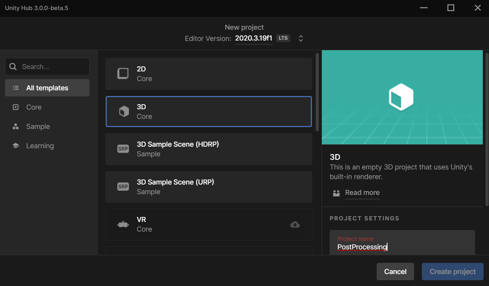 

Go to Edit > Project Settings > Graphics and make sure that the object under Scriptable Render Pipeline Settings is currently set to None. 
[What is a Render Pipeline? -->](Dictionary/Render%20Pipelines.md)
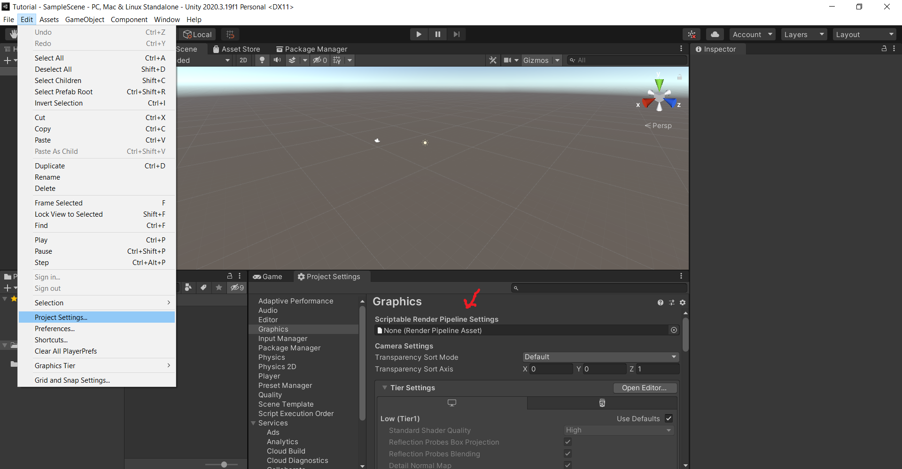 

Then go to Window > Package Manager. In the tab that pops up, switch the packages from "In Project" to "Unity Registry". Then search up "High Definition RP" in the search bar. Install it.
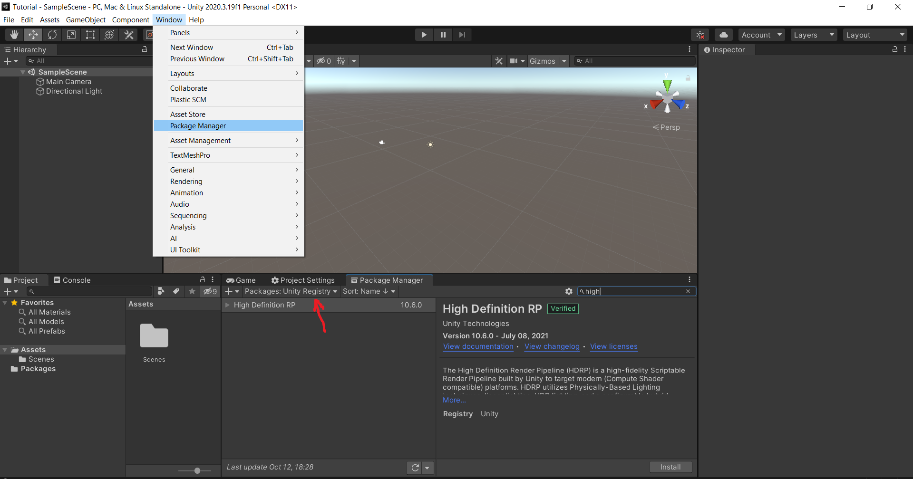 
 
 After High Definition Render Pipeline (here on out referred to as HDRP) is finished installing, the Render Pipeline Wizard will pop up. Click "Fix All" to fix the errors. After you fix the errors, something will popup called "Create or Load HDRenderPipelineAsset". Click "Create one". 
 
 **Note:** If you need to open the Wizard again, simply go to Window > Render Pipeline > HD Render Pipeline Wizard. 
 
 **Note 2:** If you want to check to make sure this worked, go to Edit > Project Settings > Graphics again and make sure Scriptable Render Pipeline Settings has been set.

  
Why are there so many errors?

  As mentioned in the "What is a Render Pipeline" file, none of the render pipelines are compatible with each other. This means that if you upload some texture to the core render pipeline, it might be missing parameters (or have extra parameters) compared to those in HDRP. You'll notice a lot of the errors talk about things not being supported or things missing for this very reason.

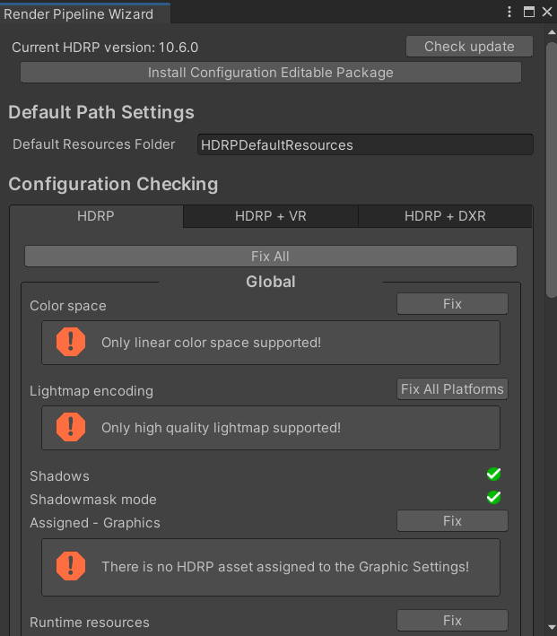 

Now find wherever you downloaded PostProcessTPKG and double click on it. An "Import Unity Package" pop up will appear. Click on Import. You should now see two more folders under assets, and a new scene in Scenes called TutorialScene. Your project should look like this once you click on TutorialScene.
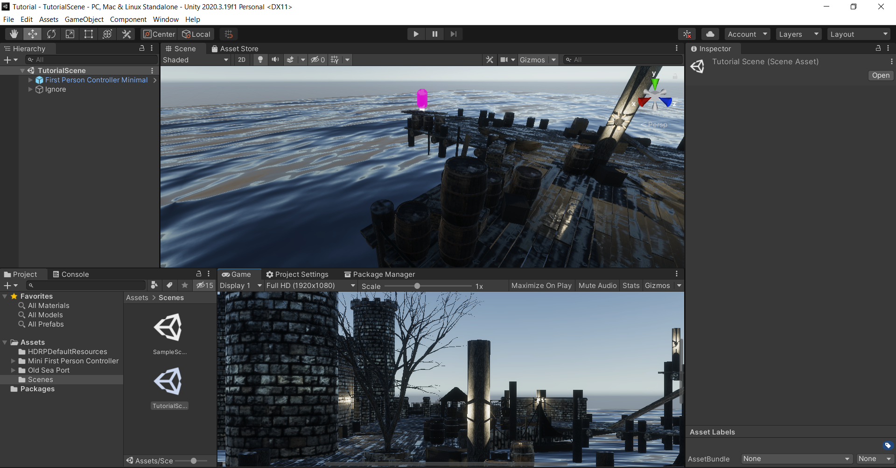 

## Setting up post-processing
Navigate to "First Person Camera" in your hierarchy (under "First Person Controller Minimal"). Upon clicking on it, navigate to your inspector and click "Add Component" at the very bottom of the inspector. Search up "Volume" and add that component.
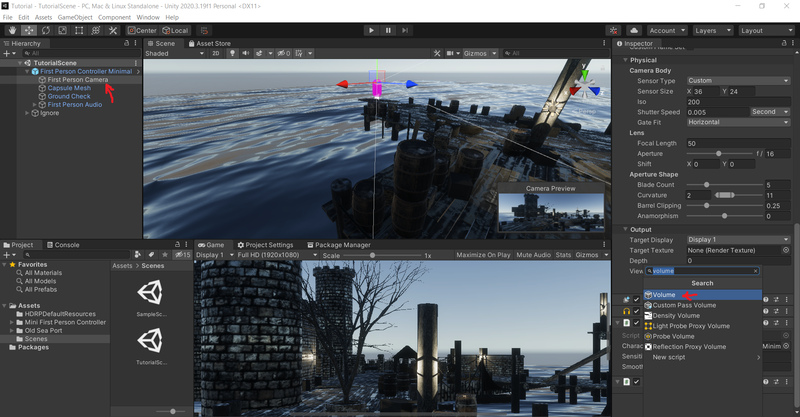 

In the volume component, create a new volume profile. 
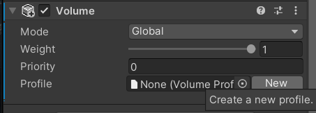 

Set your Camera's anti-aliasing (under the general component) to FXAA (Fast Approximate Anti-Aliasing). 
[What is Anti-Aliasing? -->](Dictionary/Anti-Aliasing.md) 
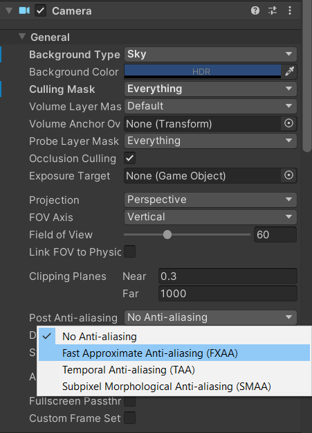 

## Creating Skyboxes
A skybox can be thought of as a wrapper around your scene and level that fills in distant environment. Because a skybox is static (doesn't move as the camera or player moves) it will immediately make the scene look more expansive. A basic skybox can be thought of as a cube (i.e. a cubemap), can be created by converting a texture's texture shape to cube. To create a compatible texture, you just need to create an "unwrapped" cube. Both the texture's shape parameters and an unwrapped cube example are below. 
[What is a Texture? -->](Dictionary/Materials%20Textures%20and%20Shaders.md) 
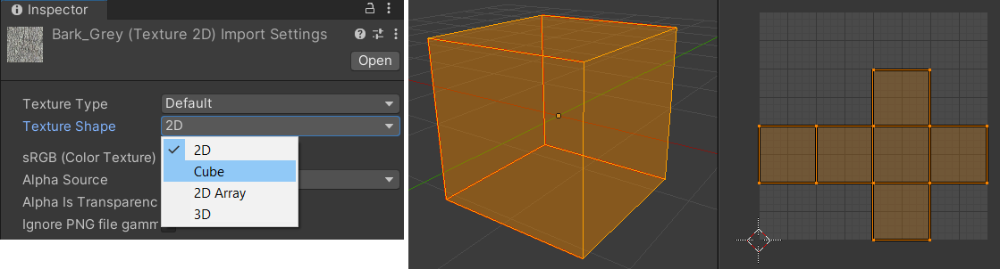 

Set an override, by going to Add Override > Sky > HDRI Sky. 
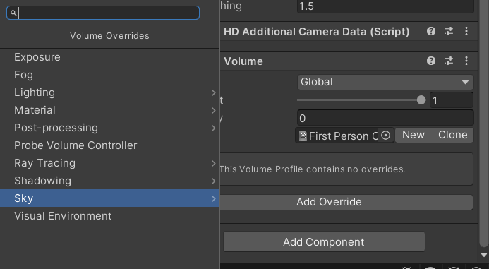 

Check the HDRI Sky variable. In your project folders, search "ReflectionProbe" And drag and drop one into the cubemap variable. Your scene should suddenly look like this: 
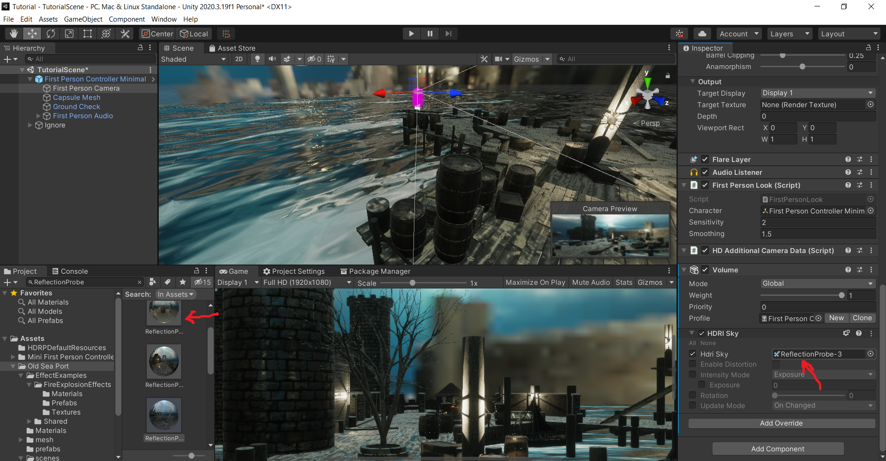 

If you don't want to use a traditional cubemap skybox, you still have options. The first is simply to play around with the general background settings under the General Camera component. 
 

If you want to use the other Sky Overrides like Gradient, or Physically Based, you have to override the Visual Environment first, before adding the other overrides.

  
Why the visual environment override?

  This is because by default, the camera (and the scene) will only be able to accept skyboxes, flat colors, or nothing (i.e. the general background settings). It doesn't matter if you add a gradient component because the ability to make gradients isn't accepted by the camera yet, unlike the ability to make skyboxes. You need to essentially override the default camera settings with new parameters to get the other types of functionality.

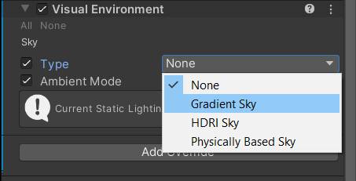 

Some settings will make the lighting seem unbearable (this is simply due to some incompatible lighting settings as the scene was ported to HDRP). To fix this, simply switch the Intensity Mode in the HDRI Sky override from Exposure to Lux.

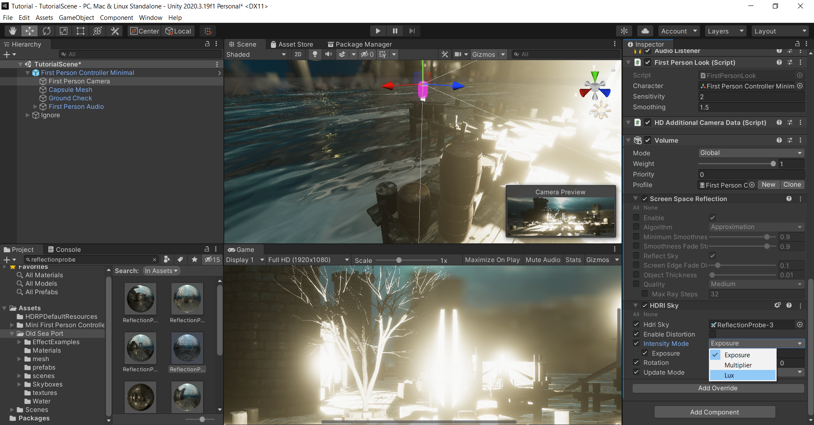 

## Creating Screen Space Reflections
Screen space reflections (from here on referred to as SSR) are quick ways to create dynamic reflections on surfaces, without a need to make every texture metallic/reflective. Instead, it uses raytracing, that simulates how light interacts with objects in the real world. Below is an example. 
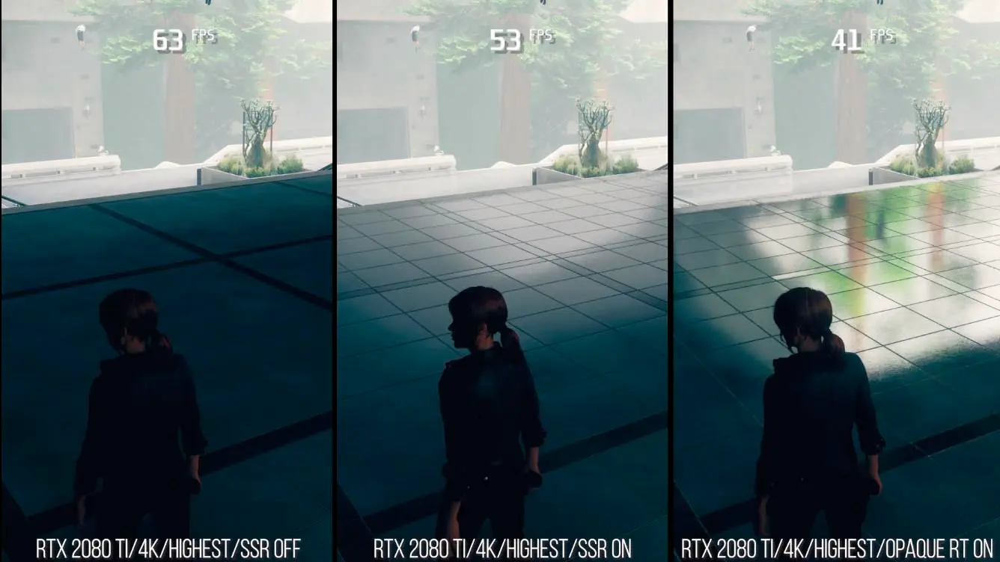 

When you first add SSR, there will be an error that says "The current HDRP Asset does not support Screen Space Reflection". This is because some post-processing effects are incredibly computationally intensive, and Unity is trying to ensure that if it does not need to load or compute a post processing effect, it doesn't. To activate SSR, go to Edit > Project Settings > Quality > HDRP. With HDRenderPipelineAsset selected, toggle the checkmark next to "Screen Space Reflection". The error should go away. Then feel free to play around with the settings as you wish. 
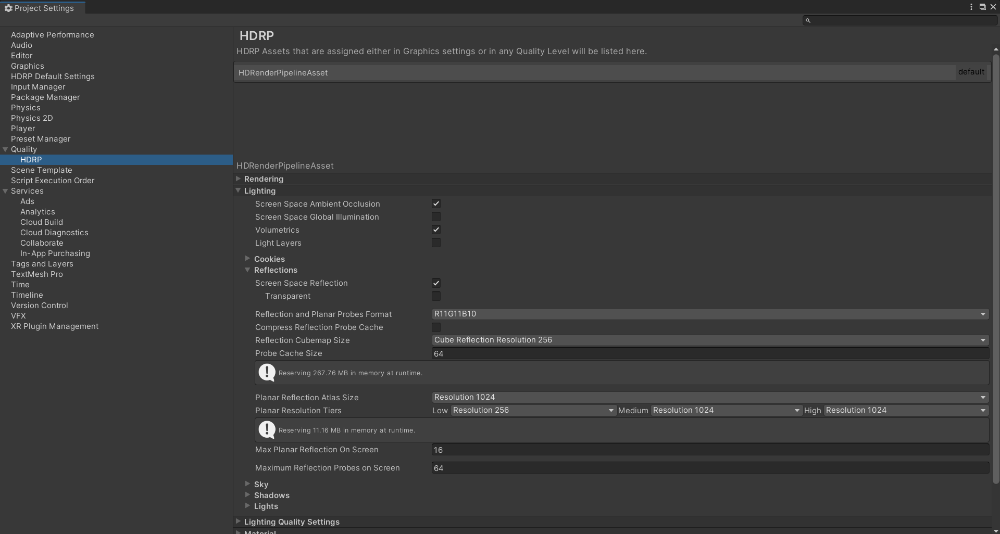 

## Navigating your workspace
Press the **Right Mouse Button (RMB)**. Drag it around to look around the scene.
Then use any of these in tandem to navigate your scene. 
**W**: Move forward 
**S**: Move back 
**A**: Move left 
**D**: Move right 
**Q**: Move up 
**E**: Move down 

If you need to zoom in or out, simply **scroll with the middle mouse button**. 
If you need to focus on some object specifically, press **f**. 

## Final Task
Change the entire mood of the base scene into something else using only post-processing! Whether it be horror/foreboding, fantastical, or otherwise, find some way to invoke a specific feeling. Feel free to play around with the other assets in the package as you wish- experimenting with what can be a tilemap, lights, etc. 

Example: 
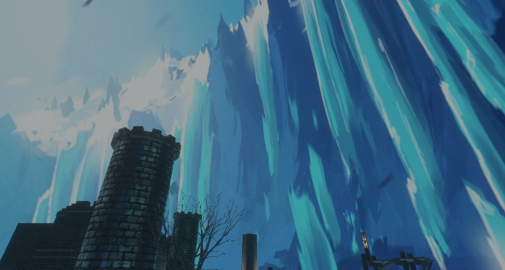 

## Essential Links
- [Studio Discord](https://discord.com/invite/bBk2Mcw)
- [Linktree](https://linktr.ee/acmstudio)
- [ACM Membership Portal](https://members.uclaacm.com/)
## Additional Resources
- [Unity Documentation](https://docs.unity3d.com/Manual/index.html)
- [ACM Website](https://www.uclaacm.com/)
- [ACM Discord](https://discord.com/invite/eWmzKsY)
 
 
