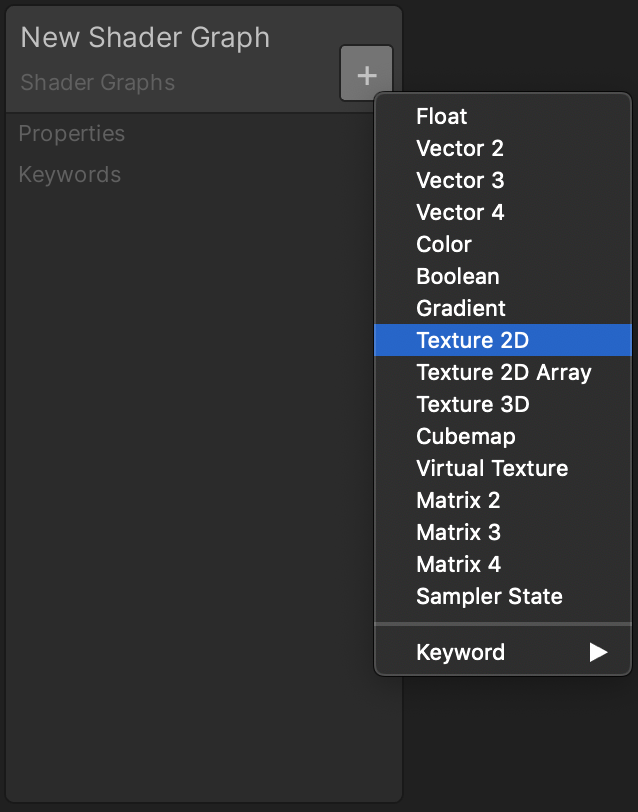
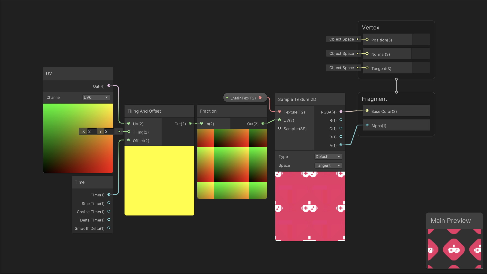
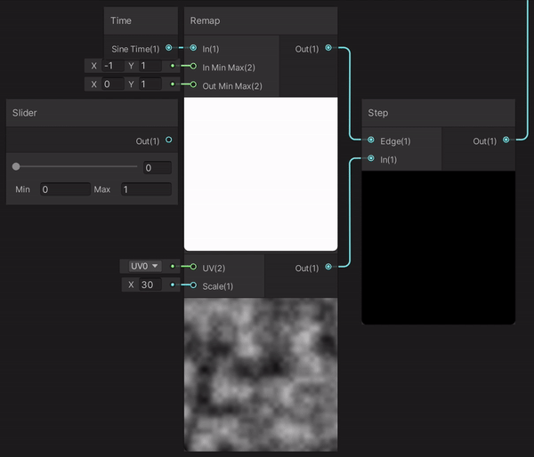

# Studio Creative Tutorials - Shader Graph
 
**Date**: Thursday, May 5th 2022, 7-9 PM PDT 
**Location**: Boelter 5422 
**Instructor(s)**: Richard Cheng, Mauve Spillard, Faustine Wang 
 
### Topics Covered
* [Shaders](#shaders)
  * [What can shaders do?](#what-can-shaders-do)
  * [What is a shader?](#what-is-a-shader)
  * [When should I use a shader?](#when-should-i-use-a-shader)
  * [How do I make and use shaders in Unity?](#how-do-i-make-and-use-shaders-in-unity)
* [Shader Graph](#shader-graph)
  * [Setup](#setup)
  * [Creating a Shader](#creating-a-shader)
  * [Sampling Textures](#sampling-textures)
  * [UV Coordinates](#uv-coordinates)
  * [Noise and Blending](#noise-and-blending)
 
### What You'll Need

 
Unity version 2020.3.33f1

 <ul>
  <li>Other 2020 versions, as well as newer versions, should also work.</li>
  <li>Note that in 2021 versions, shaders generated with Shader Graph are not compatible with UI components, unlike 2020 versions.</li>
 </ul>

 
Universal Render Pipeline (URP) package

 <ul><li>Other scriptable render pipelines (such as HDRP) should also work, although they may require more setup not covered in this tutorial.</li></ul>

 
Shader Graph package

 <ul><li>This is included in the URP and HDRP packages, but can also be installed separately.</li></ul>

Detailed setup instructions are covered [below](#setup).

---

## Shaders
### What can shaders do?
At the most basic level, shaders allow your game to render onto the screen, so the player can see the game - Unity provides a plethora of built-in shaders that do just that. However, shaders can also be used to do much, much more! Here are a few images illustrating what shaders can do, with links to guides/tutorials on recreating them:

|  |  |  |
| :-: | :-: | :-: |
| A cel shader (also known as a toon shader), featuring two-tone shading (with hard lines separating light and shadow), specular reflection (brighter highlights representing reflected light), and rim lighting (bright edges). | A monocolor dithering shader from *Return of the Obra Dinn*, using a pixellated dithering pattern to show light and shadow. | A vertex shader simulating grass blowing in the wind, achieved by animating the position of vertices based on world position and local y position. |
| [Toon Shader Tutorial](https://roystan.net/articles/toon-shader.html) | [*Return of the Obra Dinn* Devlog](https://forums.tigsource.com/index.php?topic=40832.msg1363742#msg1363742) | [Waving Grass Tutorial](https://lindenreidblog.com/2018/01/07/waving-grass-shader-in-unity/) |

### What is a shader?
Now that you've seen a few examples of interesting shaders, you may be wondering, "What is a shader?" The term **shader** is used to refer to several related concepts, but in the broadest sense a shader is a program that runs on the GPU instead of the CPU. For the purposes of this tutorial, we are interested in graphics pipeline shaders, which take some input (e.g. an image, colors, position of an object) and then do math to figure out what color the pixels on your screen should be.

For the rest of this tutorial, we will use shader to refer to this type of graphics pipeline shader specifically, unless otherwise noted, but you can read more about these other kinds of shaders at the links provided in [Additional Resources](#additional-resources) below. These graphics pipeline shaders run during the rendering step of Unity's graphics pipelines, which you can learn more about [here](https://github.com/uclaacm/studio-creative-tutorials/blob/fall-21/Post%20Processing/Dictionary/Render%20Pipelines.md).

A shader is composed of two parts: a **vertex shader** and a **fragment shader**. The vertex shader runs first, and does computations for each **vertex** in the mesh a object being rendered is composed of. Vertex shaders can run computations including moving the position of vertices to distort the mesh (and thus its appearance), and running calculations to produce data that will be used by the fragment shader, such as determining the distance to a specific point at each vertex. After the vertex shader runs, the GPU does some processing to interpolate the output of the vertex shader between the vertices, and rasterizes the object being rendered to produce **fragments**. (You can think of fragments as the pixels on the screen, although they're not actually equivalent.) Finally, the fragment shader does computations for each fragment to determine what color it should be.

#### Materials

Unity also has assets called **materials**, which are different but related to shaders. In essence, a material is a collection of textures, numbers, and other values used by the material's shader as inputs. Thus, you can create multiple materials that use the same shader, but have different values, to create different graphics while reusing the shader.

For example, the images to the right show two materials which both use the `Sprites/Default` shader, but one of them is set to be tinted blue, while the other is untinted. When applied to a sprite with the ACM Game Studio logo, the tinted material causes the logo to be tinted blue, even though both materials use the same shader.

 
An Aside About MaterialPropertyBlocks

 All objects which use the same material will share the same values for the parameters. This can be very helpful if you need to create a bunch of objects which look identical, but if you need to modify the parameters at runtime for individual instances instead of all of the objects, you can use <a href="https://docs.unity3d.com/ScriptReference/MaterialPropertyBlock.html">MaterialPropertyBlocks</a>. Unfortunately, MaterialPropertyBlocks don't work with UI components, so the other workaround for those is to create a material for each instance you want to modify separately.

### When should I use a shader?
You might also be wondering why we use shaders instead of simply baking the art style into the art. Actually, that is frequently a valid approach - but there are also many times when using a shader is better or even the only way to do something.
* Dynamic effects: For effects like lighting, the look of the object has to be calculated at runtime - there's simply no way to include how an object might look from every possible angle with every configuration of lights. Other effects that rely on data only available at runtime, such as how a building will look after the player splatters paint on it randomly, are also only feasible with shaders.
* Saving development time: Although you could in theory draw a thousand different color variations of an item, it's much less work to simply write a shader to recolor the item, especially when you can probably also reuse that shader for a thousand other items as well.
* Optimization: The GPU is really good at running calculations in parallel, so it's much more efficient to allow the GPU to animate wind blowing through thousands of blades of grass than using the CPU. (In fact, the compute shaders take this a step further by running calculations often completely unrelated to graphics on the GPU to speed up the game).

Although shaders are great, there are also times when you probably shouldn't write a custom shader:
* Unity's default shaders and components already do what you need: You don't need to wrtie a shader to fade in and out a sprite, because you can just animate the alpha channel of the color in the `Sprite Renderer`!
* Optimization: If an effect is computationally expensive to create at runtime, you may be better off pre-rendering it and including it as an asset instead. For example, in many older games 3D cutscenes are pre-rendered because computers weren't powerful enough to render good-looking scenes in real time. (Note: Many shaders also use the related trick of baking information into a texture (e.g. lightmaps, normal maps), so that information can simply be sampled from the texture instead of being calculated at runtime.)
* Prototyping: Many shaders are "visual polish" - they add to the aesthetic of a game but don't impart functionality. When you want to rapidly prototype and explore new concepts, you shouldn't be spending time on polish. (Caveat: There are shaders which you might need to make your game functional, such as outlining important objects in a scene).

### How do I make and use shaders in Unity?
Unity has two primary methods for creating custom shaders. First, you can write a shader in **ShaderLab** (a Unity-specific language used to define the structure of a shader and can contain multiple shader programs) and **HLSL** (high-level shader language, in which the actual shader programs are written). Second, you can use Unity's **Shader Graph** package to create shaders with a visual node-based system.

This tutorial will focus on Shader Graph because it's much easier to pick up, and provides an easy way to start developing your intuition for the math behind beautiful shaders (warning: shaders involve a lot of math). That being said, if you are serious about diving into the world of shaders, you'll want to learn ShaderLab and HLSL eventually, since Shader Graph has a few disadvantages such as not being compatible with the built-in render pipeline, and that some effects are impossible to create in Shader Graph alone, because more advanced features like the stencil buffer and multi-pass rendering aren't available.

Once you have a shader, regardless of how it was created, you will need a material to use it. You can right-click in the `Project` section of Unity and use `Create → Material` to create a new material, then change the shader the material uses near the top of the inspector window. After filling in any appropriate parameters for your material to provide to the shader, you can add it to a game object by finding the object's `Renderer` component (e.g. `MeshRenderer`, `SpriteRenderer`, `Image`) and dragging your material into the renderer's `Material` parameter.

## Shader Graph
### Setup

For this tutorial, we will be working in a new, empty 2D project. Since Shader Graph is not compatible with Unity's built-in render pipeline, we will need to install the Universal Render Pipeline, or URP. To install this package, open the Package Manager by going to `Window → Package Manager`, then find and install the `Universal RP` package in the Unity registry.

The Universal RP package actually includes the Shader Graph package as a dependency, so installing it will also automatically install Shader Graph as well. However, before we can start using Shader Graph, we need to configure the project's settings to use URP instead of the built-in pipeline. First, in your project right click and select: `Create → Rendering → Universal Render Pipeline → Pipeline Asset (Forward Renderer)`. This should create a `UniversalRenderPipelineAsset` and a `UniversalRenderPipelineAsset_Renderer`.

Next, go to `Edit → Project Settings` and find the `Graphics` section. In the scriptable render pipeline section, select or drag in your `UniversalRenderPipelineAsset`, as shown in the image to the right. Finally, in the hierarchy, right click and select `2D Object → Sprites → Square`. Select the square, and in the inspector, change the sprite to a more interesting image (preferably one with some transparent parts instead of a full rectangle). We will be using this sprite to test your shaders with. Congratulations, you are now ready to start working with Shader Graph!

### Creating a Shader
In the project section, right click and select `Create → Shader → Universal Render Pipeline → Sprite Unlit Shader Graph`, and name the newly create Shader Graph asset. Then right click your new Shader Graph asset and select `Create → Material`, which will create a new material that uses your new Shader Graph. Name this material too. 

Finally, select your square and drag your new material into the material parameter of the `Sprite Renderer` component. In the scene and game views, your sprite should turn into a grey square. Huzzah! You've created the simplest shader - one that always draws a grey square.

A grey square is nice, but we probably want to at least show the image you chose earlier instead. To do that, we'll need to open up Shader Graph by double-clicking on the shader graph asset you made earlier. Something like the image to the right should pop up - this is the shader graph window.

At the top of the window is a bar with a couple of buttons - most notably the `Save Asset` button. Shader Graph won't save by itself, and the normal save shortcut of `Ctrl+s` or `Cmd+s` don't seem to work, so you'll need to remember to press that save button often.

On the right side of the top bar, there are also three buttons to enable and disable the `Blackboard`, `Graph Inspector`, and the `Main Preview`. If you click these buttons, you'll find that the the `Blackboard` is that box on the left, the `Graph Inspector` is the box in the upper right, and the `Main Preview` is the box in the lower right.
* The `Blackboard` is where you can define properties (input parameters) and keywords (used to make shader variants, but outside the scope of this tutorial).
* The `Graph Inspector` is like the inspector window of the rest of Unity, except just for Shader Graph. It shows the graph's settings, and if you click on a node in the graph, it will also show the settings for that node.
* The `Main Preview` shows what the current graph will output. By default, it maps to a sphere, but since we're working with a sprite, you should right click it and select `Quad` instead.

Finally, in the center, you should see a node labeled `Vertex` and node labeled `Fragment`. We'll need to connect the output of nodes we'll create later to display a something other than a grey square. First, take a moment to examine each parameter of the `Vertex` and `Fragment` boxes. Can you guess which of the parameters on the Vertex and Fragment nodes we need to modify to show a non-grey box?

 
Answer

 We need to change the Base Color(3) of the fragment node! If you click on the grey box connected to the Base Color(3) node, you can pick a different non-grey color for your sprite. Progress! If you also mess around with the Alpha(1) node, you'll also see that it changes how transparent our box is.
 
 An important note is that the numbers at the end of each value indicate how many channels that value holds. For instance, Base Color(3) has 3 channels - namely red, green, and blue. Position(3) also has three channels, but in this case they something completely different (x, y, and z coordinates). Alpha(1) only has 1 channel, the transparency of the image. Values with up to 4 channels are frequent in shaders, and it's important to keep track of how many channels each value has, and what each channel represents.

You can create new nodes by right clicking and selecting a node from the list. You can move nodes by clicking and dragging them, and you can pan around the graph by holding the left alt key while clicking and dragging. Finally, you can create connections between nodes by clicking and dragging from a circular port on the right side of a node (an output) to a circular port on the left side of a node (an input). This allows data to "flow" from one node to the next.

### Sampling Textures
To display the sprite instead of a square, the shader will need a texture to display. In particular, we want to display a `Texture2D`, which is a two-dimensional image that can be wrapped onto a three-dimensional mesh, or in our case, a flat `Quad`. In case you're curious, there are also `Texture3D` assets, which store three-dimensional information.

While we could simply use a Texture 2D asset node to input the image that you chose earlier, this node will always provide the same texture. If we want our shader to work even if we change what image to display in the `Sprite Renderer`, our shader needs a property, through which the renderer will provide a texture to our shader.

On the `Blackboard`, click the plus button and add a new `Texture2D` property. Click on the property to inspect it in the `Node Settings` section of the `Graph Inspector`. Change the `name` **and** the `reference` to `_MainTex` exactly. The reference **must** be `_MainTex` in order for the renderer to correctly supply the sprite to the shader. (If you write code to control shaders, you'll also need to use the reference to set the values of properties.) In addition, you should choose your image as the default value for `_MainTex`, so it will appear when we start connecting nodes.

Click and drag the `_MainTex` property onto the graph to create a node. Unfortunately, if we try to drag the output of this node to attach it to any of the vertex and fragment inputs, it will fail to connect, because we can't convert a `Texture2D` into `Vector(3)` or a `Vector(1)`. Instead, we need to sample the texture first. Right click and select `Create Node`. Then find and select `Sample Texture 2D` by typing in the search bar or under `Input → Texture` to create the node. Connect the `_MainTex` node to the `Texture(T2)` input of the `Sample Texture 2D` node, and your image should appear in the preview for the sample texture node!

The `Sample Texture 2D` node also has two other inputs, of which `UV(2)` is very important. But we'll cover that a little later. Instead, we now need to link the output of the `Sample Texture 2D` node to the output so that our shader correctly displays an image. Try to figure this part out on your own based on what you've learned so far! The solution is below if you get stuck.

 
Finished shader

 
 Connect the RGBA(4) output to the Base Color(3) input. Note that even though RGBA has 4 channels, shader graph intelligently drops the 4th channel automatically. However, that means we also still need to supply that 4th alpha channel somewhere, namely the Alpha(1) input. If you don't do this, your image won't have transparent parts!

### UV Coordinates
#### What are UV coordinates?
UV coordinates are a way of mapping a 2D texture onto a 3D surface! As shown in the images below, to properly texture a 3D model you need some way to "unwrap" the 3D model into a flat 2D plane. Then a shader can use those UV coordinates to determine what should go on your screen.

 
 

Even though we're working with sprite shaders today, it turns out there are a lot of neat things you can do with UV coordinates, even when you're on a `Quad` (a flat plane). But first, let's take a look at how to read UV coordinates in Shader Graph. The image to the right shows a UV node connected to a `Split` node to split the two channels of the UV. Each channel is then connected to a `Preview` node to show what each channel looks like.

The preview of the UV might be confusing at first glance, but take a look at each channel separately. The red channel is black on the left and white on the right, indicating that it increases from 0 to 1 from left to right. Similarly, the green channel is black on the bottom and white on the top, increasing from 0 to 1 from bottom to top. So basically, the default UV coordinates are a square with (0,0) in the lower left corner and (1,1) in the upper right, and this is represented with red and green. Thus, in the lower left, where red and green are both close to 0, the preview is black, and in the upper right where red and green are both close to 1, the preview is a bright yellow (the combination of red and green). On the lower right where red is much greater than green, the preview is red, and in the upper left where green is much greater than red, the preview appears green.

When we sample a texture with the Sample Texture 2D node, the node uses these UV coordinates to map the texture. The lower left corner of the texture is mapped to (0,0), and the upper right corner to (1,1), and the center to (0.5,0.5). If we modify the UV by adding a small value to it, the sampled texture will appear to have shifted slightly, since (0,0), (1,1) and all other coordinates will have shifted positions slightly!

Does this make sense? If not, try playing around with it, using some basic math nodes to modify the UV! It will be important to understand UV coordinates for the next section.

#### Transforming UV coordinates
Pop quiz time! Using UV coordinates, figure out how to make each effect.

 
Flip an image vertically.

 
 If we subtract the green channel from 1, that makes the top of the square black, and the bottom white, flipping it vertically. (There is a subtract node, but why use that when we have a handy one-minus node available?) Then we recombine it with the red channel and feed that into the UV coordinates, resulting in an image that has been flipped vertically.

 
Flip an image across its diagonal.

 
 If we simply swap the red and the green channels, our image is flipped across the diagonal! (There's actually a node for this called the Swizzle node, which works for changing the order of up to 4 channels. This solution just splits and recombines for clarity though.)

 
Rotate an image 90 degrees counterclockwise.

 
 The solution to this puzzle is simply combining the previous two puzzles. We use one minus on the red channel to flip the image horizontally before swizzling to also flip the image across its diagonal. Combined these two effects make it seem like the image has been rotated. Also note the use of a redirect node to route the connection around another node, making the graph more readable! You can create redirect nodes by right-clicking on the line connecting two nodes.

 
Fully duplicate the image in each corner. 
  
 

 
 Here, we multiply the entire UV by 2, so the UV now goes from 0 to 2 both horizontally and vertically. Then, we take the fractional part of that with the fraction node, resulting in going from 0 to 1 and then 0 to 1 again. This leaves us with 4 copies of the UV, one in each corner. There's actually a Tiling and Offset node, which we will cover next, that does this as well.

#### Scrolling Textures
The Tiling and Offset node allows us to tile UV coordinates to create duplicates of an image, with an offset. We can combine this with the Time node, which provides input information about how much time has passed, to create an infinitely scrolling texture. Using these nodes and what you've learned so far, try creating a shader which will tile an image four times and scroll infinitely, repeating the images forever!

 
Infinitely scrolling textures!

 
 We can connect the time node to the Offset(2) to scroll diagonally. This works by adding the offset to the UVs, so that the (1,1) corner appears to move towards the lower left as time increases! However, we need to take the fractional component of the Tiling and Offset node since both tiling and offset so that values greater than 1 are "wrapped around" to 0, thus repeating the texture infinitely.

#### Screen Space UV
Right click and create a `Screen Position` node. Look familiar? Try swapping it in and playing around with it to see what happens!

 
UV Spaces

 Thus far, we've been working with UVs in terms of the object, but you can also apply UVs from other "spaces" or coordinate systems, such as the entire screen, where the lower left corner of the screen is (0,0) and the upper right corner of the screen is (1,1). In case you didn't see it while messing around, the Screen node provides the width and height of the screen, so some simple division can tell you how to scale an image to maintain its correct aspect ratio and size. In addition to screen UVs, you can even use world position as your UVs!

### Noise and Blending
For the final shader of this tutorial, we will be making a dissolving shader, shown in the gif below. **Before moving on**, closely observe the effect and try to figure out how it could be made, based on what you know. What do you already know how to do? What kind of nodes or math functions that we haven't covered so far might be helpful for creating this effect? 

 

As you may have guessed from this section's title, one of the important tools that we need to create this effect is **noise**. In this context, noise refers to a type of procedural texture, where the color or value of the texture is based on pseudo-random mathematical functions using the (u,v) coordinates as input parameters. However, noise is not completely random, as for many applications, such as this one, we don't want adjacent (u, v) positions to have completely different values. Instead, the values are interpolated, so that nearby values are more similar and there is a smoother transition. If you want to learn more about noise, you can read more about it [here](https://www.ronja-tutorials.com/noise.html).

The image to the right shows the `Simple Noise` node. Notice how the interpolation makes the noise looks a little fuzzy, unlike TV static. Similar to the `Sample Texture 2D` node, this and other noise nodes have a UV input to allow you to distort the sampling of the noise texture, but the noise node also has a `Scale(1)` input, which you can adjust to "zoom" in and out. As in the image to the right, you can set the scale to 30 (or a similar number) to get a good balance between detail and graininess, although please also experiment with changing around the scale to see the difference it makes on the appearance of the dissolve effect!

But how can we turn this random pattern into the dissolve effect?

 
Answer

 
 We can use the noise to modify the alpha channel of the original image! However, if we directly connect the noise node to the alpha channel to the Alpha(1) node of the fragment, the sprite will not follow its original shape since the alpha value no longer follows the original shape of the texture, as shown in the image to the right. Instead, the entire UV (in this case a square) will have some visibility. 
  Clearly, we will need to combine the alpha channel of the original texture with the noise. While we could do this directly with some math nodes, we can also use a Blend node. The blend node provides a large selection of different blend modes to combine Base and Blend values. The blend node also takes in an Opacity(1) value, which determines the blend strength - in areas where the opacity is 0, no blending will occur and the Base value will be output, and in areas where the opacity is 1, the base and blend values will be fully blended. 
  In our case, since we want to reduce the alpha value, we can use alpha channel of our texture as the Base, the noise as the blend, and use the Darken blend mode. We can keep the opacity as 1 for the entire blend, since darken will keep the lower of the base and blend, meaning that fully transparent areas where alpha is 0 will be kept at 0.

We now have a "cloudy" version of our texture, but we also need to "animate" it to vary between fully transparent and fully visible. How can we do that with what you've learned earlier?

 
Answer

 To animate the texture between fully transparent and fully visible, we can add the noise to a value that varies between -1 and 1 over time, before using the sum as the blend value. When the value is -1, the sum will vary between -1 and 0, so the blend will be fully transparent, and when the value is 1, the sum will vary between 1 and 2, so the blend will not darken our original texture at all. Conveniently, the Time node also provides the sine of time, which varies between -1 and 1, so we can use that (or cosine). You can also instead create a Slider node to manually adjust the value being added to the noise, which is helpful for visually debugging your shader. 

This creates a shader which animates a texture appearing/disappearing in a cloudy manner, sort of like fog appearing or dissapating. Although this is certainly an interesting effect, the effect we want to make has a hard edge between a fully transparent area and the visible area. What kind of mathematical function do we need to create this hard edge?

 
Answer

 
 
 To create distinct areas of transparency and visibility, instead directly using the noise, we need to modify such that it has values of only 0 or 1, for transparent and visible areas. One easy way to do this is the Step node, which compares the value of In to Edge at each point. Step outputs 0 at that point if In is less than Edge, and outputs 1 at that point if In is greater than Edge. 
  If we attach a Time or Slider node as the edge, we can see that this generates the pattern we need for the dissolve effect. Note that since we only need the Edge to vary between 0 and 1, you will want to remap the sine of time, since sine varies between -1 and 1. We can then use the Out of the Step node as the value for Blend in the blend node. We're almost done - we just need to create the differently colored-edge! 
  We can create this edge by creating a second Step node and offsetting it ever so slightly by adding a small number to Edge(1). Create a new Float property in the Blackboard called Edge Width, and remember to set a default value for it (0.05 is what is used in the example gif). Add it to the remapped sine of time, before using the sum as the Edge for a new Step node. We can use the same In value (the noise) for this second Step node, which will output a pattern with slightly more of the image set to be transparent (you can preview this edge if you subtract this Step node from the original Step node). 
  Since we want the edge part to be colored, instead of black, we need to reverse the output of the Step node (with the Subtract or One-Minus nodes), to produce a pattern where the invisible parts, plus a small edge covering the visible portion, is white. To color this edge, we can multiply the entire reversed pattern by a color (which you should also make a property in the Blackboard). 
  Finally, we need to blend this pattern with the RGBA(4) of the original texture and output the blend as our final Base Color(3). In this case, we want to replace the original color with our new color on the edge area, so we want to use the Overwrite blend mode. However, this also overwrites the visible parts of our original texture with black, so we need to use the reversed Step node from before as the Opacity(1), so we only overwrite the edge (and the invisible portions, which of course can be overwritten freely since we won't see it anyway). 

Congratulations, you have completed a fancy-looking shader which makes sprites dissolve! The solution is also hidden below if you want to reference it.

 
Complete Dissolve Shader Graph

 

---

## Additional Resources
* [Unity Documentation: Shaders](https://docs.unity3d.com/Manual/Shaders.html)
* [Unity Documentation: ShaderLab](https://docs.unity3d.com/Manual/SL-Reference.html)
* [Unity Documentation: Shader Graph](https://docs.unity3d.com/Packages/com.unity.shadergraph@10.9/manual/index.html)
* [Unity Documentation: MaterialPropertyBlocks](https://docs.unity3d.com/ScriptReference/MaterialPropertyBlock.html)
* [Render Pipelines](https://github.com/uclaacm/studio-creative-tutorials/blob/fall-21/Post%20Processing/Dictionary/Render%20Pipelines.md)
* [Noise](https://www.ronja-tutorials.com/noise.html)

## Non-Essential Links
- [Studio Discord](https://discord.com/invite/bBk2Mcw)
- [Studio Website](https://acmstudio.carrd.co/)
- [ACM Membership Portal](https://members.uclaacm.com/)
- [Unity Documentation](https://docs.unity3d.com/Manual/index.html)
- [ACM Website](https://www.uclaacm.com/)
- [ACM Discord](https://discord.com/invite/eWmzKsY)
