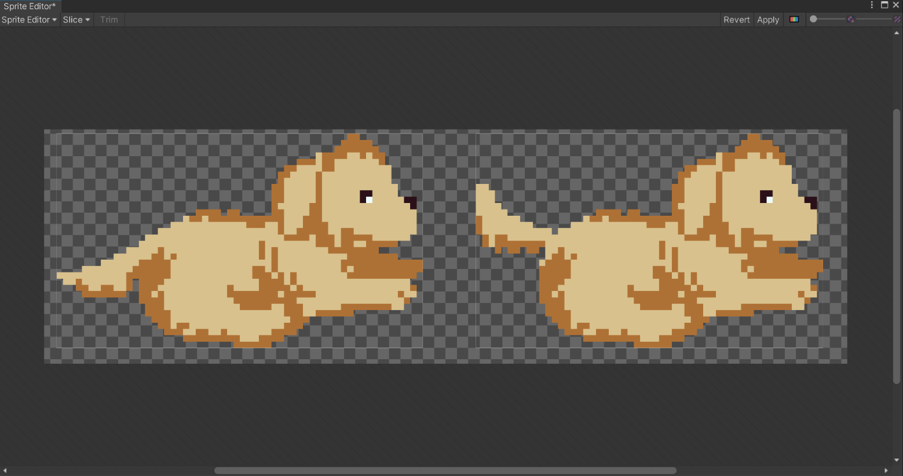
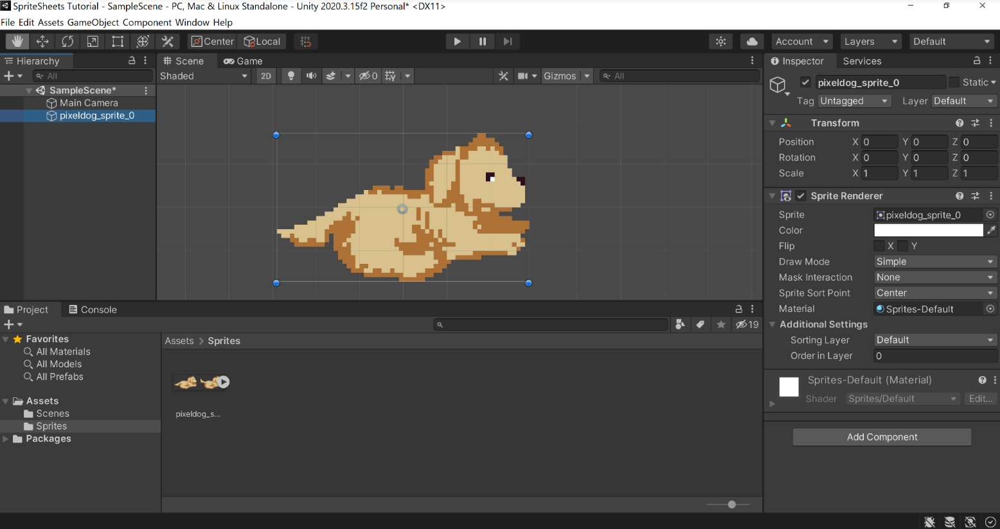
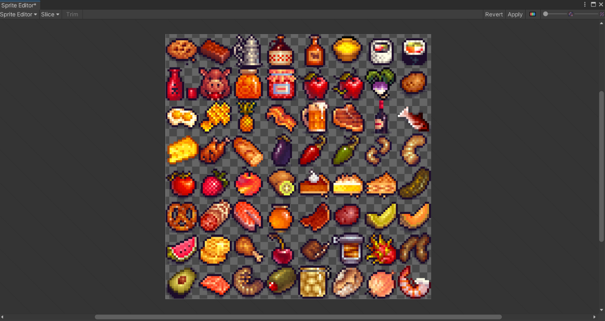
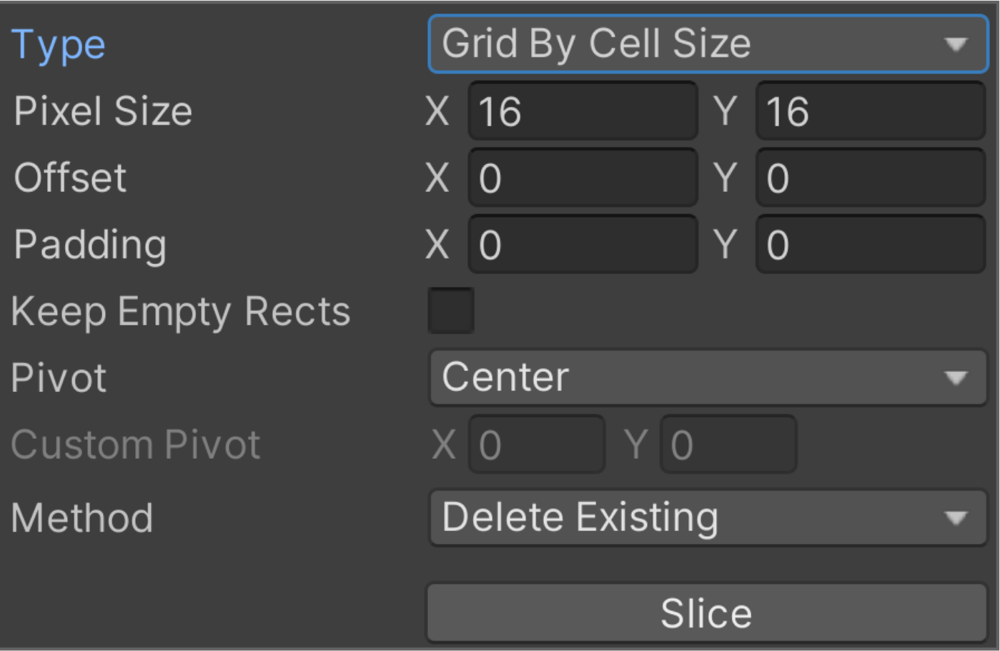
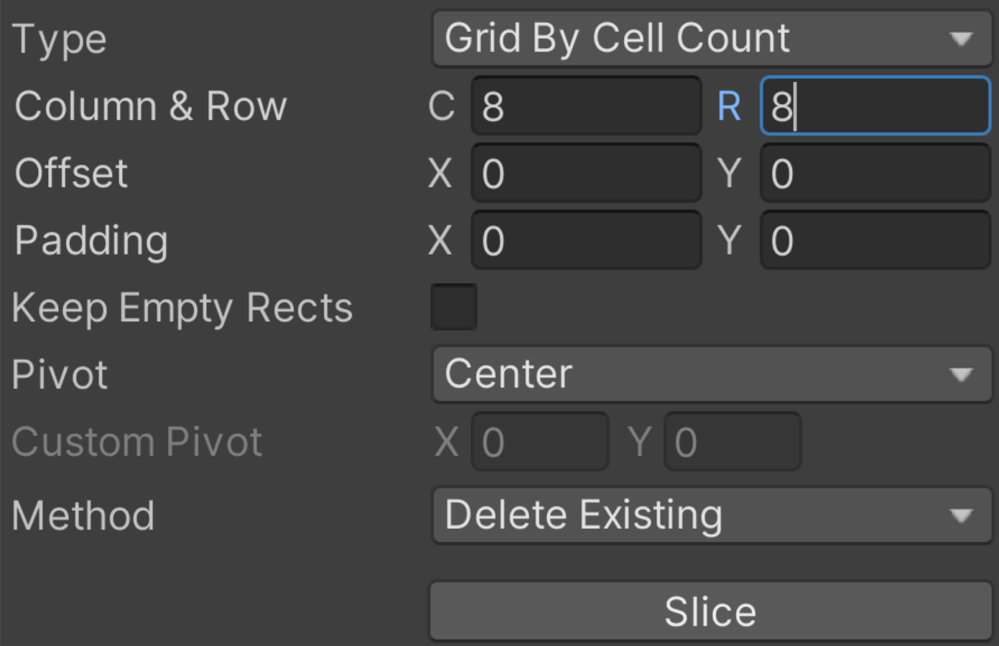
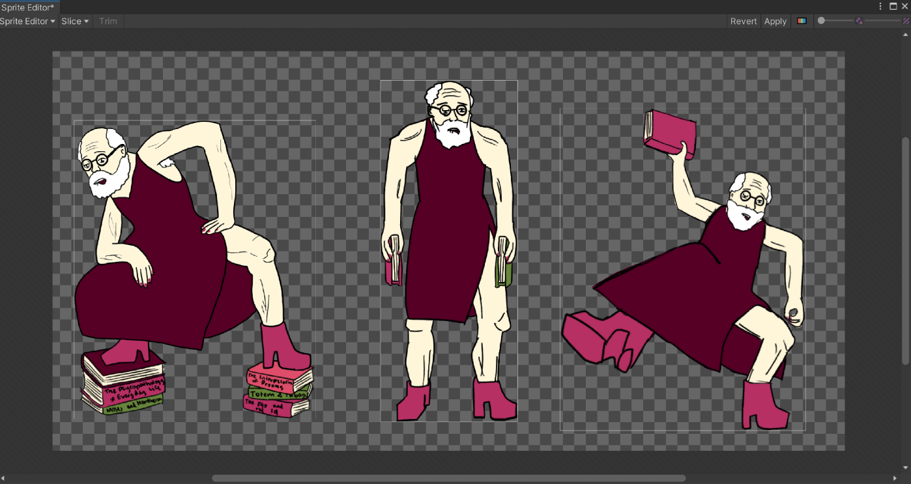
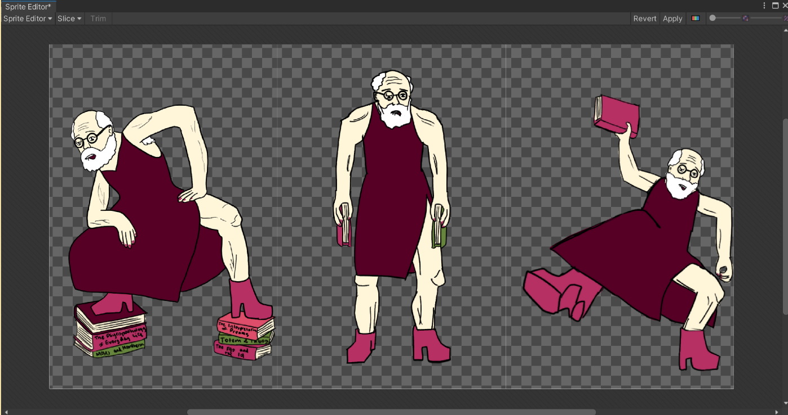
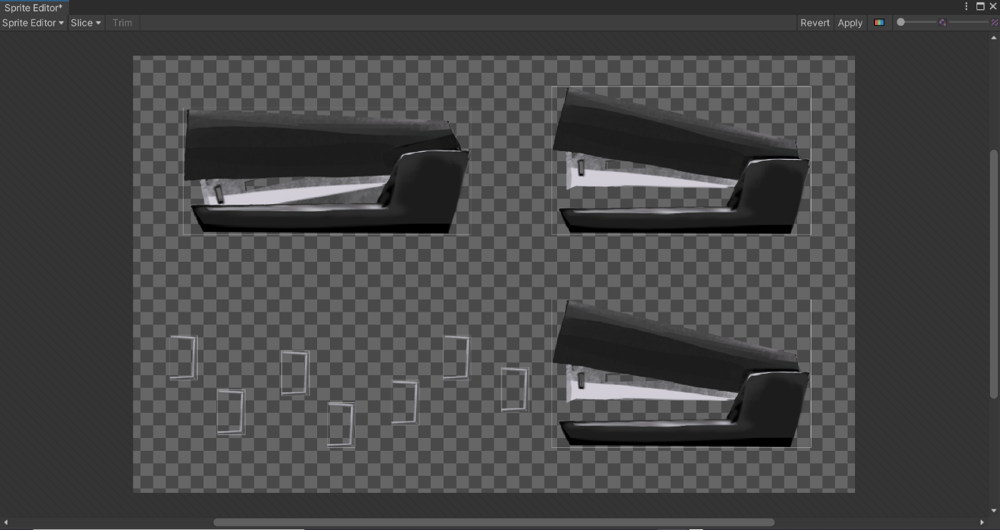
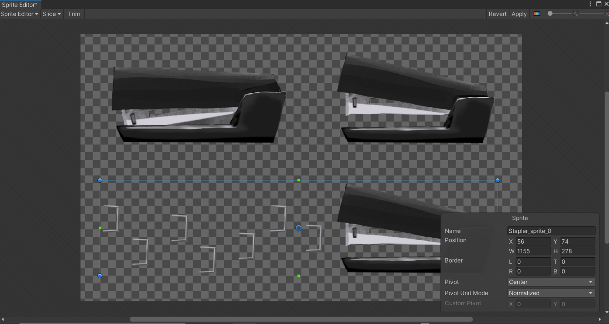
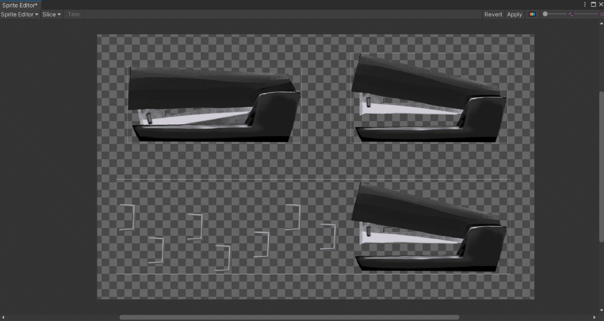

# Studio Creative Tutorials - Sprite Sheets & Tilemaps
 
**Date**: October 18, 2021 
**Location**: Online (On Zoom) 
**Instructor(s)**: Ray Hsiao, Zoë Chavez
 
## Resources
[Video](https://youtu.be/olHfwMMzKg0) 
[Zoom Link](https://ucla.zoom.us/j/94661432392) 
 
## Topics Covered
* Best practices for art assets
* Using the Sprite Editor
* Slicing Sprite Sheets and Tilemaps
* Using Tile Palettes
* Adding tiles to your Scene
 
## What you'll need
* [Unity Hub](https://unity.com/download)
* [Unity 2020.3.19f2](https://unity3d.com/unity/qa/lts-releases)
* This [Package](https://github.com/uclaacm/studio-creative-tutorials-f21/blob/main/Sprite%20Sheets%20%26%20Tilemaps/SpriteSheets_Tilemaps_Tutorial_2021.unitypackage)
---

## Topics covered
* Best practices for art assets
* Using the Sprite Editor
* Slicing Sprite Sheets and Tilemaps
* Using Tile Palettes
* Adding tiles to your Scene

## Sprite Sheets

### Basics
A sprite is a 2D image or animation separate from the background of a scene. A sprite can also be defined as a box with variable alpha channels, which is what represents transparency and ranges between 0 (transparent) and 1 (opaque). A Sprite Sheet is an image file containing multiple sprites, ideally in a tiled grid arrangement since that makes separating sprites easier. It is preferable to import a Sprite Sheet into Unity rather than each individual sprite. It is more time-efficient (if the Sprite Sheet is correctly processed) and reduces draw calls (based on number of materials, not number of objects), improving performance.

### Resolution and Unity PPU
A common screen resolution is 1920x1080 (Full HD), so we will continue with this tutorial with that being our assumed screen resolution. 

Unity screen space (space defined by the screen) scales using Pixels Per Unit (PPU), which is unchangeable from 100 PPU. Because of this, you need to be careful with your import settings: even if your art is proportional, and your character is 200 pixels and your tiles are 200 pixels, if you pass in 1 unit unmodified to Unity, it will only ever move you 100 pixels at a time.

### Pixel Art Best Practices
Good dimensions for pixel backgrounds are 320x180 (scale up by a factor of 6) and 640x360 (scale up by a factor of 3). The largest dimensions people generally use for pixel sprites is 64x64. Originally, pixel art was a result of technological limitations, which is why 8-bit, 16-bit, and so on are used for retro games.

Make a small canvas with the exact number of pixels you need and use a 1 pixel brush (make sure to turn off antialiasing and other effects). After importing into Unity, reduce the field of the camera to match the size of your canvas. If you use a large canvas with a large “pixel” brush, you’re almost guaranteed to fail to meet the criteria for pixel art. If the canvas dimensions aren’t a multiple of the “pixel” brush dimensions, you will have cut-off “pixels.” If the “pixel” brush is larger than 1 pixel, it will cut off your previously drawn “pixels” like so:
 

### Raster Art Best Practices
It’s best to draw at a larger resolution and then scale down since scaling up will decrease quality. When making art assets, it’s best to decide on the size for one particular asset and scale other assets accordingly.

### Pixel Dog Example
In the Sprites folder under Assets, open the Inspector for the dog. Make sure to set the Texture Type to “Sprite (2D and UI)” and Sprite Mode to “Multiple” -- this will be necessary for all of the following examples as well. If you don’t have these settings, you won’t be able to open the Sprite Editor. The Sprite Mode “Single” is for when there is only one sprite in the asset rather than an entire Sprite Sheet, and the Sprite Mode “Polygon” clips the sprite into a customizable polygon shape other than a rectangle (default).

Set Filter to “Point (no filter)”, and Compression to “None”. These settings are specific to pixel art. The other Filter options (Bilinear and Trilinear) are intended for raster art -- they create a gradient to smooth out pixelation at higher resolutions, which just results in blurriness for pixel art. Pixel art is already low resolution, so there is no reason to compress the images further. 

Make sure to hit Apply after making these changes!

Open up the Sprite Editor in the Inspector. Automatic slicing cuts a Sprite Sheet based on the alpha channel (transparency). Since we have two isolated dog sprites in our Sprite Sheet, we can effectively use Automatic slicing to cut our sprites! Click on the “Slice” dropdown button at the top of the Sprite Editor window, and apply Automatic slicing. (Just use the default settings -- we’ll go over changing the settings later.)

 

By default, Unity will name the cut sprites [FILENAME]_[INDEX], with an index starting at 0. In this case, it’s perfectly reasonable to have the sprites named “pixeldog_sprite_0” and “pixeldog_sprite_1”, so we can leave it as is.

Now, you can drag your dog into the hierarchy! If you want to use a different sprite, click the right arrow on the sprite in the Project window and drag the sprite you want from there.

 

### Pixel Food Example
Note: These food sprites can be yours for free through the [Unity Asset Store](https://assetstore.unity.com/packages/2d/environments/free-pixel-food-113523)!

Sprite Sheets can contain completely distinct sprites! This Sprite Sheet lets you add a whopping 64 food sprites at once with just one imported image!

 

Notice that the sprites aren’t completely separated from each other. In this case, Automatic slicing wouldn’t work as well since it would consider adjacent touching sprites as a single sprite instead of multiple.

One alternative is Grid By Cell Size slicing. Each individual sprite is 16x16 pixels, so you could input that and slice the Sprite Sheet into 64 sprites that way.

 

However, that requires some math and extra steps, so I would recommend Grid By Cell Count slicing instead. Since we know that there are 8 rows and 8 columns of sprites, we can just input that and slice up the Sprite Sheet into 64 sprites that way.

 

You might be wondering about the other settings. The Pivot is the anchor point of the sprite. If you want to move a sprite from point A to point B: the Pivot will be the point on the sprite that maps to those points. If you rotate the sprite, it will rotate around the pivot.

If there’s a consistent amount of empty space between the sprites in the Sprite Sheet, you can edit the Padding. For example, if there’s 1x1 px space between the sprites, edit the X and Y of the Padding each to be 1.

The offset is used to alter where the Pivot is past the dropdown menu options.

(Will go over Method later.)

Click on one of the sprites. Here, the default naming convention of [FILENAME]_[INDEX] doesn’t work well since we have 64 distinct foods and Food_0, Food_1, etc. give you no information on what food each sprite represents. You can edit the name of the Sprite in the bottom-left window in the Sprite Editor.

### Workarounds for Problematic Sprite Sheets

Freudian Slip is intended to swap between these different poses in game! Because of that, it’d be terribly inconvenient for the programmers if his sprites are all different sizes.
 

We can instead cut his Sprite Sheet into 3 columns. This is why it’s best for Sprite Sheets to already adhere to some sort of grid formatting -- If the rightmost Freud were in the same position as in the previous image, the tip of his shoe would have been sliced as part of the middle Freud sprite.

 

Here is another problematic Sprite Sheet.

We want the bottom stapler and the staple projectiles to be a single sprite! However, Automatic slicing doesn’t know that and instead separates them into different sprites. 

 

You can manually create the borders for a sprite by clicking and dragging on the canvas WITHOUT Slice selected.

 

After dealing with the bottom stapler, you can use Automatic slicing on the top two staplers! By setting the Method to Safe, the Sprite Editor will cut new sprites without affecting your previously cut sprites.
 

The Delete Existing option will replace existing selections, and Smart will attempt to create new rectangles while retaining or adjusting existing ones.
 

## Tilemaps

### Basics
A tilemap is a grid that allows you to place sprites or “tiles” into your game in order to create environments and/or streamline the level building process. A tileset is a collection of “tiles” available for you to use on your tilemap. In Unity, tilesets are typically created by slicing a larger sprite into several smaller tiles, and creating a tile palette that you can use to draw in your environment/level. In this section we will cover how to create a tilemap, create a tile palette from a sprite, and use the drawing tools to create a game environment.

### Breakdown of Steps
1. Import Assets
    * I’ve included them in the package
    * We will start with the sprite labeled “TX Tileset Grass”
2. In the Inspector, set “Sprite Mode” to Multiple
    * Apply this setting
3. Open the Sprite Editor
4. Click the small arrow button next to the Sprite Editor drop down
5. Under “Type”, decide if you will need to cut by “Cell Size”, “Cell Count” or Automatic
    * If you know the size in pixels that you need each tile to be, select “Cell Size”
    * If you have regular tiles and you know how many tiles across and down your sprite contains, select “Cell Size”
    * For example, sometimes I create tilesets that are meant to be cut in 3x3 squares, so I choose 3 cells by 3 cells
    * If you have irregular (not all uniform size) sprites on a transparent sprite sheet, select “Automatic”
6. For our first tileset, we will be using “Cell Size”
    * The artist created these tiles to be 64x64
    * Type 64 under pixel size for both x and y
    * Click “Slice”
    * Click “Apply”
    * Exit out of the sprite editor
7. In your scene, create a new Game Object
    * Right click, “2D Object”, “Tilemap”, “Rectangular”
    * Other grids available include hexagon and isometric, but we will not be using those today
8. You should see a grid and a selection to create a Tile Palette. Open the Tile Palette Window
9. Click “Create New Palette” and name it
10. Drag your tileset into the tile palette
11. Tile Palette Tools
    * Select Tool: Click and drag to select an area on the grid in the scene view
    * Move Tool: Click and drag to move your selection in the scene view
    * Paint Tool: Select a tile on the palette and draw onto the grid in the scene view
    * Fill Selection Tool: Fill a selected area on the grid with the active brush (tile)
    * Erase Tool: Erase tiles from the grid in the scene view
    * Flood Fill Tool: Fill an enclosed area on the grid with the active brush (tile) (The area you want to fill does not need to be selected, it just needs to have a border)
12. You can also use tilemaps for other assets to make putting then into your scene easier
13. Find the sprite labeled “TX Props” and repeat steps 2-6
    * For this one we will be using “Automatic”
    * You will see that it will automatically cut around each of these props
    * Now drag the sprite into your palette and start drawing again
14. Play around with your palette and create an environment!
15. Now we will make our environment function as a platformer level. Go to your Tilemap Renderer and Add Component “Tilemap Collider 2D”
    * This will make it so that objects cannot pass through your tiles
16. Add Component “Composite Collider 2D”
    * This will group together neighboring tiles so that there are not too many individual colliders affecting your game’s performance
    * Doing this will automatically add the component  “Rigid Body 2D” to your tilemap as well
    * Now go to the Tilemap Collider component and check the box that says “use by composite”
17. Add Component “Platform Effector 2D” since we are making a platformer
    * If you are creating a top-down game, you will not need this component
    * Check the box on your Composite Collider 2D that says “used by effector”
18. Now let’s put a player into our scene by dragging in the player prefab in your package
19. In play mode, move your player around your platforms (WASD). As you can see, the player is able to stand on top of the platforms and not fall through. 
20. Now let’s play around with the Platform Effector 2D. Go ahead and paint in a platform above where your player starts.
    * Make sure that “Surface Arc” is set to 180. Now use the W key to jump up through the platform in play mode. You should be able to land on top of it. This is because the Platform Effector 2D manages one way colliders, which means you can jump through the bottom of a platform but not fall through the top when the Surface Arc is set to 180
    * Try setting Surface Arc to 360 and see the difference. Now, you are unable to jump through the bottom of the platform because the collider is blocking your character from passing through the tiles from any angle.
    * You can use this setting and the “Sides” settings to create more complex platforms, including ones you can slide or bounce off of. 
21. Continue playing around in your scene! If you’re interested in what else you can do with tilemaps, I recommend looking into Prefab Brushes, which unfortunately I wasn’t able to cover today. Here is a quick tutorial that I recommend: https://www.youtube.com/watch?v=UqhK6GpCgrM 

## Essential Links
- [Studio Discord](https://discord.com/invite/bBk2Mcw)
- [Linktree](https://linktr.ee/acmstudio)
- [ACM Membership Portal](https://members.uclaacm.com/)
## Additional Resources
- [Unity Documentation](https://docs.unity3d.com/Manual/index.html)
- [ACM Website](https://www.uclaacm.com/)
- [ACM Discord](https://discord.com/invite/eWmzKsY)
 
 
